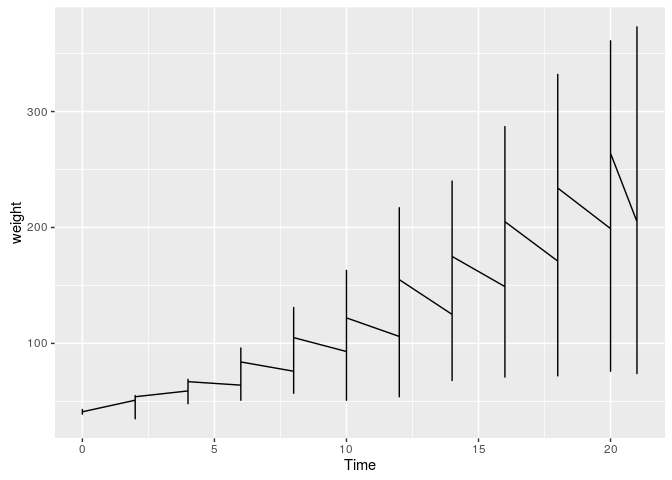
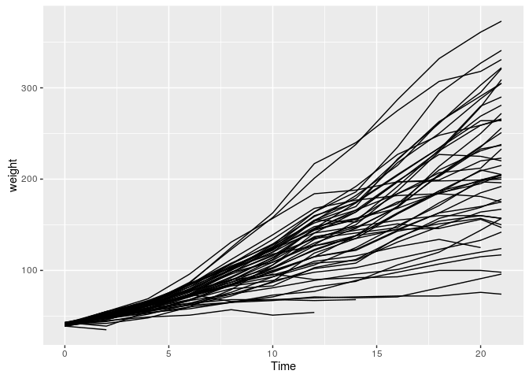
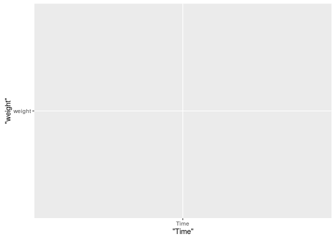
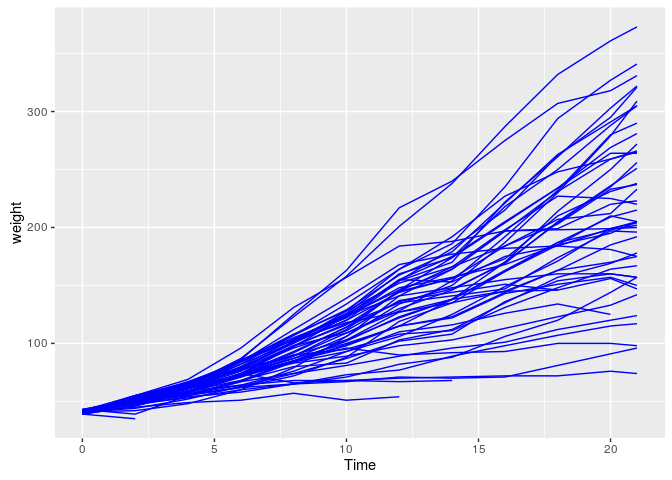
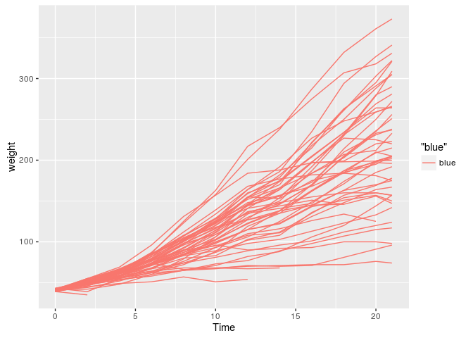
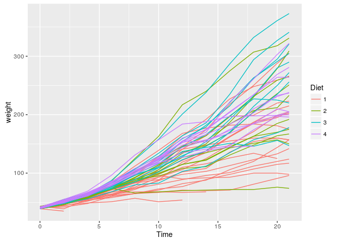
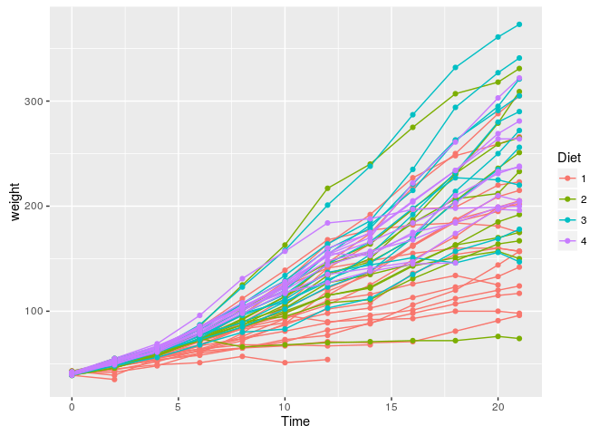
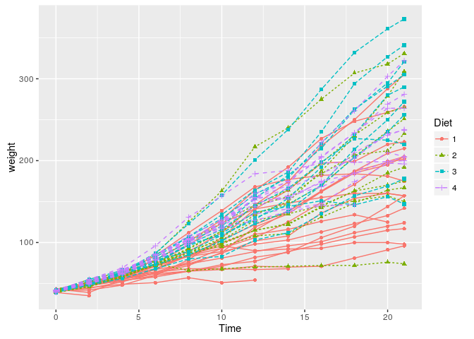
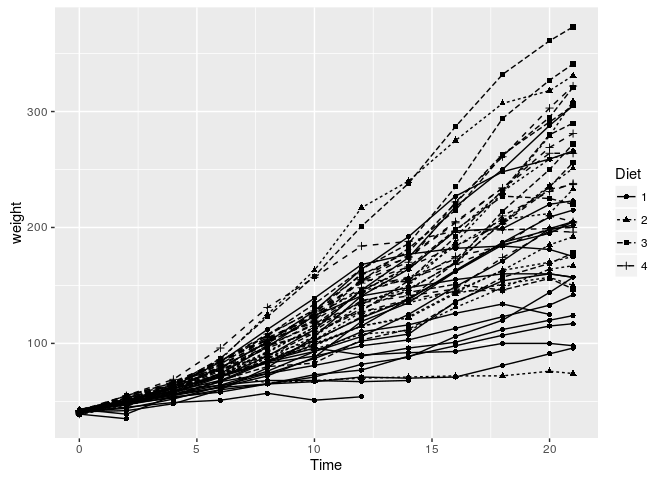
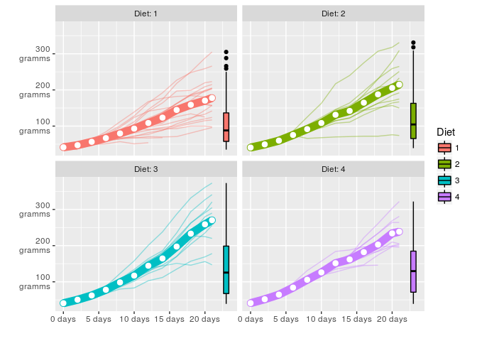

``` r
library(ggplot2)
```

Each ggplot starts with data. Data **must be a data frame**! We use some data on the weight of chickens on different diets over time:

``` r
head(ChickWeight)
```

    ##   weight Time Chick Diet
    ## 1     42    0     1    1
    ## 2     51    2     1    1
    ## 3     59    4     1    1
    ## 4     64    6     1    1
    ## 5     76    8     1    1
    ## 6     93   10     1    1

``` r
is.data.frame(ChickWeight)
```

    ## [1] TRUE

``` r
ggplot(data = ChickWeight)
```

<!-- -->

ggplot knows about our data but nothing happens yet. We need to add a layer and literally *add* it with `+`. **We add elements to a plot by adding them with a `+`.**

``` r
ggplot(data = ChickWeight) +
  geom_line(aes(x = Time, y = weight))
```

<!-- -->

We used the `aes()` function to map x-position to the variable `Time` and y-position to the variable `weight`. Each column in your data frame is a variable. y-position and x-position are examples of visual properties (others are colour, size, shape, alpha, fill, radius, linetype, group...). **Everytime you map a variable to a visual property you do it with `aes()`**

The plot looks strange. A single line is drawn across all data points. We want separate lines. One for each chicken:

``` r
ggplot(data = ChickWeight) +
  geom_line(aes(x = Time, y = weight, group = Chick))
```

<!-- -->

Note that we don't write `x = ChickWeight$Time` or `y = "weight"`. We simply spell out the name of the variable we wish to work with. ggplot is aware of the dataset we work with. It is *attached*. Quoting the variable names would actually produce unexpected results:

``` r
ggplot(data = ChickWeight) +
  geom_line(aes(x = "Time", y = "weight"))
```

<!-- -->

What happened? ggplot interpreted the quoted strings as raw data instead of variable names of our data frame. It then tries to plot it... When **referring to the variables in your data fame, always use unqoted column names**.

Let's colour all of the lines blue:

``` r
ggplot(data = ChickWeight) +
  geom_line(aes(x = Time, y = weight, group = Chick), colour = "blue")
```

<!-- -->

We wrote `colour = "blue` outside of the `aes()` function as we *set* the visual property to a fixed value instead of *mapping* a visual property to a variable in the data frame. Let's move the statement into the `aes()` function:

``` r
ggplot(data = ChickWeight) +
  geom_line(aes(x = Time, y = weight, group = Chick, colour = "blue"))
```

<!-- -->

Classic ggplot moment here... "blue" is interpreted as raw data as we have written it inside of the `aes()` function. ggplot thinks all of our rows belong to group "blue", mapped to the visual property colour. ggplot assigns a default colour scale of which the first colour is a light red. This becomes obvious if we map a real variable to colour:

``` r
ggplot(data = ChickWeight) +
  geom_line(aes(x = Time, y = weight, group = Chick, colour = Diet))
```

<!-- -->

Lesson to be learned: The difference between *mapping* and *setting* a visual property. **We map visual properties to variables inside `aes()`, we set visual properties to a fixed value outside of `aes()`**.

We can add more than a single layer to a plot. ggplot 2.0.0 comes with 27 *geometries* (`geom_`). Some of them are super straightforward and just draw points or lines or rectangles. Some draw complex shapes after transforming your data in various ways. **We can think of geometries as flexible templates for different plot types.** Combining different geometries is a common workflow with ggplot. E.g. adding `geom_point` to `geom_line` gives lines with points on them:

``` r
ggplot(data = ChickWeight) +
  geom_line(aes(x = Time, y = weight, group = Chick, colour = Diet)) +
  geom_point(aes(x = Time, y = weight, group = Chick, colour = Diet))
```

<!-- -->

If we use identical mappings in our layers we can move them in the `ggplot()` function. **Everything inside the `ggplot()` function is passed down to all other plot elements.**

``` r
ggplot(data = ChickWeight, aes(x = Time, y = weight, group = Chick, colour = Diet)) +
  geom_line() +
  geom_point()
```

<!-- -->

You can still add arguments to the individual layers:

``` r
ggplot(data = ChickWeight, aes(x = Time, y = weight, group = Chick, colour = Diet)) +
  geom_line(aes(linetype = Diet)) +
  geom_point(aes(shape = Diet))
```

<!-- -->

Unlike real life, you also have the power to override commands from above:

``` r
ggplot(data = ChickWeight, aes(x = Time, y = weight, group = Chick, colour = Diet)) +
  geom_line(aes(linetype = Diet), colour = "black") +
  geom_point(aes(shape = Diet), colour = "black")
```

<!-- -->

ggplot wants you to combine a set of flexible elements to get the desired result, whatever it may be. **You are in charge of designing your plot**.

``` r
ggplot(ChickWeight, aes(x = Time, y = weight, color = Diet)) +
  geom_line(aes(group = Chick), alpha = 0.4) +
  geom_line(stat = "summary", fun.y = "mean",
            size = 4) +
  geom_point(stat = "summary", fun.y = "mean", fill = "white",
             shape = 21, size = 3) +
  geom_boxplot(aes(x = 23, fill = Diet), colour = "black") +
  scale_x_continuous("", labels = scales::unit_format("days")) +
  scale_y_continuous("", labels = scales::unit_format("gramms", sep = "\n")) +
  facet_wrap(~Diet, labeller = label_both)
```

<!-- -->

More on that in the next sessions...

**Further reading**:

-   [How to do your bread and butter graphs in ggplot](http://www.cookbook-r.com/Graphs/)
-   [THE ggplot2 Cheat-Sheet](https://www.rstudio.com/wp-content/uploads/2015/03/ggplot2-cheatsheet.pdf). A handy reference sheet, not only compressing most of the `ggplot2` functionality into 2 pages, but also outlining the underlying logic.
-   [Elegant Graphics for Data Analysis](https://www.springer.com/us/book/9780387981406): The book by the author of `ggplot` himself and despite being quite outdated it is still a good place to learn the general idea as well as the deeper functionalities of the library. An updated version is about to get published (as of February 2016). If you have patience and some skills in `LaTeX` and `R` you can compile the new version of the book yourself. All the source files are publicly available [here](https://github.com/hadley/ggplot2-book).
-   [The Grammar of Graphics](https://www.springer.com/us/book/9780387245447): `ggplot` is modelled after the framework for describing visualizations introduced in this book. If you are eager to learn where `ggplot` comes from, look here. cc-by Jonas Schöley 2016

``` r
sessionInfo()
```

    ## R version 3.2.2 (2015-08-14)
    ## Platform: x86_64-pc-linux-gnu (64-bit)
    ## Running under: Ubuntu 15.10
    ## 
    ## locale:
    ##  [1] LC_CTYPE=en_US.UTF-8       LC_NUMERIC=C              
    ##  [3] LC_TIME=en_GB.UTF-8        LC_COLLATE=en_US.UTF-8    
    ##  [5] LC_MONETARY=en_GB.UTF-8    LC_MESSAGES=en_US.UTF-8   
    ##  [7] LC_PAPER=en_GB.UTF-8       LC_NAME=C                 
    ##  [9] LC_ADDRESS=C               LC_TELEPHONE=C            
    ## [11] LC_MEASUREMENT=en_GB.UTF-8 LC_IDENTIFICATION=C       
    ## 
    ## attached base packages:
    ## [1] stats     graphics  grDevices utils     datasets  methods   base     
    ## 
    ## other attached packages:
    ## [1] ggplot2_2.0.0
    ## 
    ## loaded via a namespace (and not attached):
    ##  [1] Rcpp_0.12.3      digest_0.6.9     grid_3.2.2       plyr_1.8.3      
    ##  [5] gtable_0.1.2     magrittr_1.5     evaluate_0.8     scales_0.3.0    
    ##  [9] stringi_1.0-1    rmarkdown_0.9.3  labeling_0.3     tools_3.2.2     
    ## [13] stringr_1.0.0    munsell_0.4.2    yaml_2.1.13      colorspace_1.2-6
    ## [17] htmltools_0.3    knitr_1.12.3
