GGplot Workshop: Session 2, Data (and facets)
================
Jonas Schöley
February 8th, 2016

Every Variable In Its Own Column
--------------------------------

``` r
library(ggplot2) # can ya dig it?!
```

**Data structure matters a lot when working with ggplot**. However, once we provided ggplot with nice and tidy data it does a lot by itself. In order for this to work the data needs to be in the right format to begin with: **data needs to be a data frame** and **every variable of interest needs to be a separate column**. Let's explore what that means.

``` r
head(WorldPhones)
```

    ##      N.Amer Europe Asia S.Amer Oceania Africa Mid.Amer
    ## 1951  45939  21574 2876   1815    1646     89      555
    ## 1956  60423  29990 4708   2568    2366   1411      733
    ## 1957  64721  32510 5230   2695    2526   1546      773
    ## 1958  68484  35218 6662   2845    2691   1663      836
    ## 1959  71799  37598 6856   3000    2868   1769      911
    ## 1960  76036  40341 8220   3145    3054   1905     1008

Here's the number of telephone connections over time by continent. The first problem with this data is that it's not a *data frame*, it's a matrix with row and column names. If we try to plot it, well...

``` r
ggplot(WorldPhones)
```

    ## Error: ggplot2 doesn't know how to deal with data of class matrix

That's easily fixed however

``` r
phones <- as.data.frame(WorldPhones)
```

Say we we want to plot the number of telephone connections over time by continent. This implies the following *variables of interest*:

-   the number of telephone connections `n`
-   the continent `cont`
-   the year `year`

Problem is, *none* of these variables are explicitly given in our data frame. Of course the data is all there, just not in a format we can use with ggplot. Remember: all we handle in ggplot are names of variables which in turn are columns of a data frame. So the question is how to reshape the data into a form where all the variables of interest are separate columns in the data frame.

To reshape we are going to use additional libraries. To follow the code you need to be familiar with [dplyr](https://cran.rstudio.com/web/packages/dplyr/vignettes/introduction.html) and [tidyr](https://cran.r-project.org/web/packages/tidyr/vignettes/tidy-data.html).

``` r
library(tidyr); library(dplyr)
```

    ## 
    ## Attaching package: 'dplyr'

    ## The following objects are masked from 'package:stats':
    ## 
    ##     filter, lag

    ## The following objects are masked from 'package:base':
    ## 
    ##     intersect, setdiff, setequal, union

The easiest variable to make explicit is the year. It is given as rownames of the data frame. We take the rownames, convert them from character to integer type, and add them as the variable `year` to the data frame.

``` r
phones %>%
  mutate(year = as.integer(rownames(.))) -> phones
phones
```

    ##   N.Amer Europe Asia S.Amer Oceania Africa Mid.Amer year
    ## 1  45939  21574 2876   1815    1646     89      555 1951
    ## 2  60423  29990 4708   2568    2366   1411      733 1956
    ## 3  64721  32510 5230   2695    2526   1546      773 1957
    ## 4  68484  35218 6662   2845    2691   1663      836 1958
    ## 5  71799  37598 6856   3000    2868   1769      911 1959
    ## 6  76036  40341 8220   3145    3054   1905     1008 1960
    ## 7  79831  43173 9053   3338    3224   2005     1076 1961

That leaves us with the variables *"number of telephone connections"* and *"continent"* to make explicit. They shall become separate columns in the data frame. With the help of `gather()` we **transform from wide to long format**.

``` r
phones %>%
  gather(key = cont, value = n, -year) -> phones
phones
```

    ##    year     cont     n
    ## 1  1951   N.Amer 45939
    ## 2  1956   N.Amer 60423
    ## 3  1957   N.Amer 64721
    ## 4  1958   N.Amer 68484
    ## 5  1959   N.Amer 71799
    ## 6  1960   N.Amer 76036
    ## 7  1961   N.Amer 79831
    ## 8  1951   Europe 21574
    ## 9  1956   Europe 29990
    ## 10 1957   Europe 32510
    ## 11 1958   Europe 35218
    ## 12 1959   Europe 37598
    ## 13 1960   Europe 40341
    ## 14 1961   Europe 43173
    ## 15 1951     Asia  2876
    ## 16 1956     Asia  4708
    ## 17 1957     Asia  5230
    ## 18 1958     Asia  6662
    ## 19 1959     Asia  6856
    ## 20 1960     Asia  8220
    ## 21 1961     Asia  9053
    ## 22 1951   S.Amer  1815
    ## 23 1956   S.Amer  2568
    ## 24 1957   S.Amer  2695
    ## 25 1958   S.Amer  2845
    ## 26 1959   S.Amer  3000
    ## 27 1960   S.Amer  3145
    ## 28 1961   S.Amer  3338
    ## 29 1951  Oceania  1646
    ## 30 1956  Oceania  2366
    ## 31 1957  Oceania  2526
    ## 32 1958  Oceania  2691
    ## 33 1959  Oceania  2868
    ## 34 1960  Oceania  3054
    ## 35 1961  Oceania  3224
    ## 36 1951   Africa    89
    ## 37 1956   Africa  1411
    ## 38 1957   Africa  1546
    ## 39 1958   Africa  1663
    ## 40 1959   Africa  1769
    ## 41 1960   Africa  1905
    ## 42 1961   Africa  2005
    ## 43 1951 Mid.Amer   555
    ## 44 1956 Mid.Amer   733
    ## 45 1957 Mid.Amer   773
    ## 46 1958 Mid.Amer   836
    ## 47 1959 Mid.Amer   911
    ## 48 1960 Mid.Amer  1008
    ## 49 1961 Mid.Amer  1076

What kind of black magic did just happen? *A short primer on wide versus long data format:*

Each table has a *wide format* and a long format representation. The information content is the same in both formats. It's the layout that differs.

Here's a wide format table containing the explicit variables `Female` and `Male`.

``` r
data.frame(Female = 1:2, Male = 3:4) -> wide
wide
```

    ##   Female Male
    ## 1      1    3
    ## 2      2    4

The same table in long format representation containing the explicit variables `Sex` and `N`.

``` r
data.frame(Female = 1:2, Male = 3:4) %>%
  gather(key = Sex, value = N) -> long
long
```

    ##      Sex N
    ## 1 Female 1
    ## 2 Female 2
    ## 3   Male 3
    ## 4   Male 4

Back to our telephone example. We told the computer to look at all columns apart from `year` and transform them into the columns `cont` and `n`. `cont` holds the continent names for the variable `n`, the number of telephone connections. The continent names ar<!-- -->e taken from the original column names we *gathered* over.

We now can plot our data easily.

``` r
ggplot(phones) +
  geom_line(aes(x = year, y = n, colour = cont))
```


Data Pipelines
--------------

We can also write everything we did so far as a single *data analysis pipeline*. We start with the raw data and output a plot. This is a great approach for fast, interactive data analysis.

This is what we need to know in order to build pipelines:

-   The object on the left of the pipe operator (`%>%`) is passed onto the first argument of the function on the right
-   If we want to use the object on the left in other places than the first argument we can explicitly refer to it by using a dot (`.`)

Here's our telephone example in pipeline form.

``` r
# the raw data...
WorldPhones %>%
  # ...is converted to a data frame...
  as.data.frame() %>%
  # ...the rownames are added as the column `year`...
  # (note that I use the dot here to explicitly refer to the input data)
  mutate(year = as.integer(rownames(.))) %>%
  # ...the data gets transformed from wide to long format...
  gather(key = cont, value = n, -year) %>%
  # ...and finally plotted
  # (note that I can pipe the tidy data frame directly into ggplot)
  ggplot() +
  geom_line(aes(x = year, y = n, colour = cont))
```

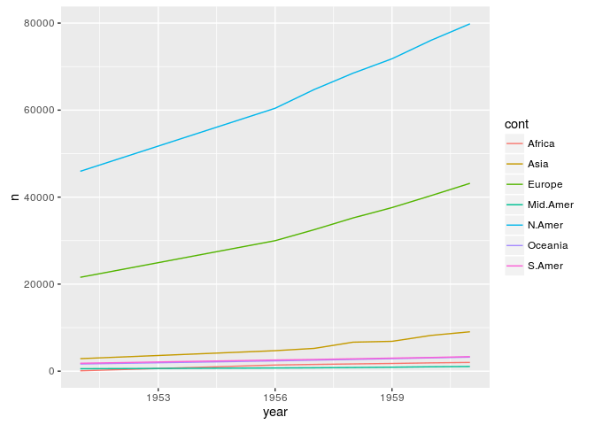

Practice, practice, practice...
-------------------------------

Before we start plotting we need to ask ourselves: *What do we need to do with our data in order to get the plot we want?* Here are some examples.

``` r
# we start with raw data...
USArrests %>%
  mutate(
    # ...and add the new variable `state` from the rownames...
    state = rownames(.),
    # ...we then reorder the levels of `state` according to the percentage of
    # people living in urban areas...
    state = reorder(state, UrbanPop)) %>%
  # ...and make a dotplot of the percentage of urban population by state...
  ggplot() +
  geom_point(aes(x = UrbanPop, y = state))
```

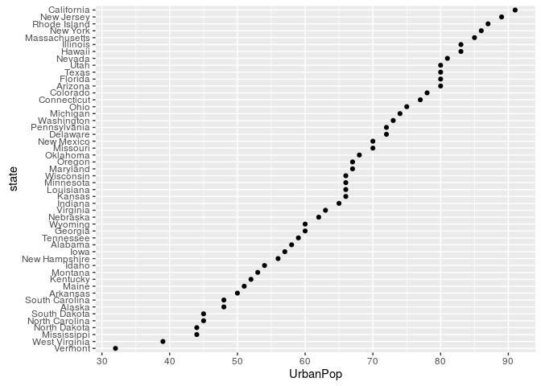

``` r
# we start with raw data...
USArrests %>%
  mutate(
    # ...and add the new variable `state` from the rownames...
    state = rownames(.),
    # ...we then reorder the levels of `state` according to the combined
    # murder, assault and crime rates...
    state = reorder(state, Murder+Assault+Rape)) %>%
  # ...we convert to long format, gathering "Assault", "Murder" and "Rape"
  # into "crime"...
  gather(key = crime, value = rate, -state, -UrbanPop) %>%
  # ...and make a dotplot of the crime-rate by crime and state
  ggplot() +
  geom_point(aes(x = rate, y = state, colour = crime))
```

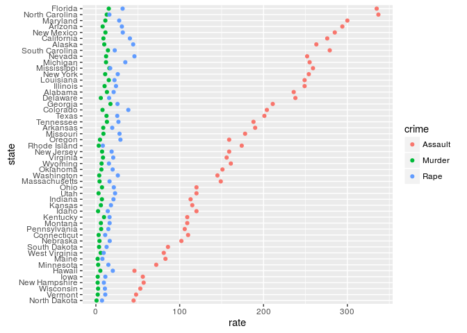

``` r
library(ggrepel) # brilliant package for labelling points in a scatterplot
# we start with raw data...
USArrests %>%
  # ...and add the new variable `state` from the rownames...
  mutate(state = rownames(.)) %>%
  # ...andmake a labelled scatterplot of Murder versus Rape
  ggplot(aes(x = Murder, y = Rape)) +
  geom_text_repel(aes(label = state),
                  colour = "grey",
                  segment.color = "grey",
                  size = 3) +
  geom_point()
```


Can you figure out what happens here? Try running the code yourself line by line.

``` r
anscombe %>%
  mutate(id = rownames(.)) %>%
  gather(... = -id) %>%
  separate(key, sep = 1, into = c("axis", "panel")) %>%
  spread(key = axis, value = value) %>%
  ggplot(aes(x = x, y = y)) +
  geom_smooth(method = "lm", se = FALSE) +
  geom_point() +
  facet_wrap(~panel)
```

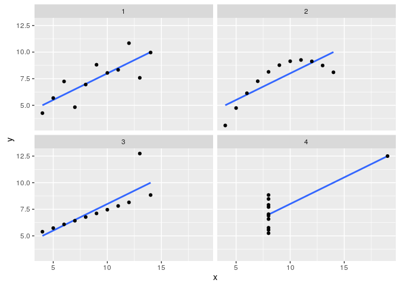

Facets
------

**Facets are multiples of the same plot separate by groups in the data**.

Without facets everything is plotted into a single panel.

``` r
infert %>% mutate(case = ifelse(case == 0, "control", "case")) %>%
  ggplot(aes(x = age, linetype = case, colour = education)) +
  geom_density()
```

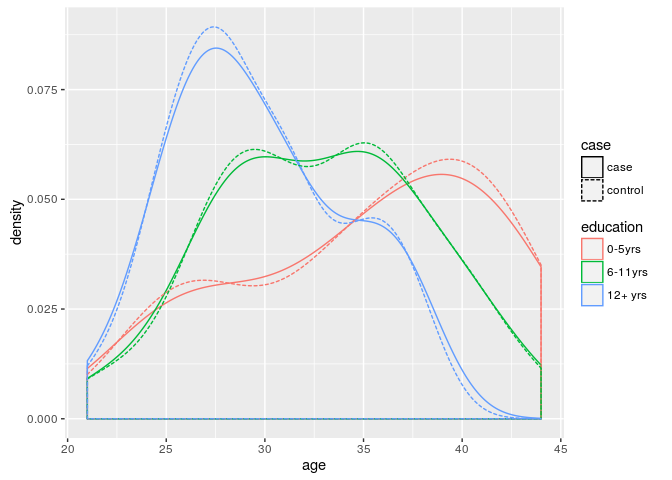

After specifying the facetting variable (`~case`) multiple panels are drawn, one for each subgroup in the variable.

``` r
infert %>% mutate(case = ifelse(case == 0, "control", "case")) %>%
  ggplot(aes(x = age, linetype = case, colour = education)) +
  geom_density() +
  facet_grid(~case)
```

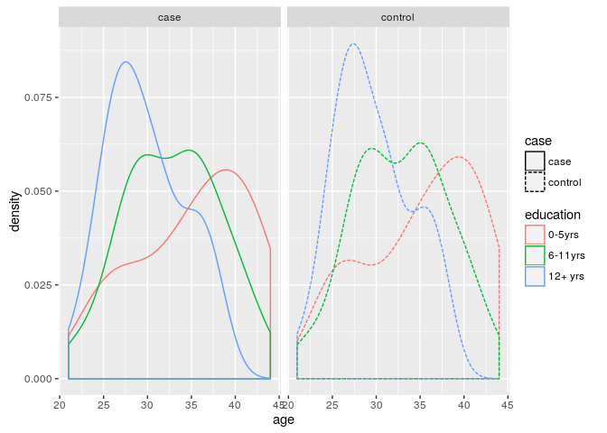

We can facet over multiple variables.

``` r
infert %>% mutate(case = ifelse(case == 0, "control", "case")) %>%
  ggplot(aes(x = age, linetype = case, colour = education)) +
  geom_density() +
  facet_grid(education~case)
```

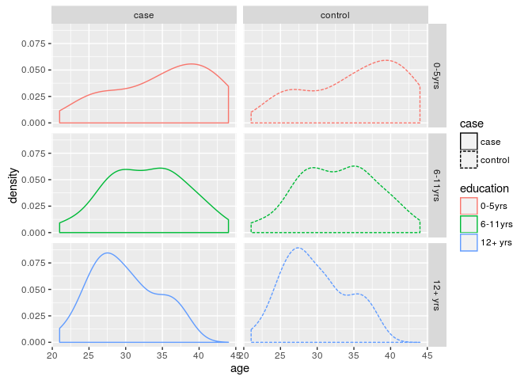

There are various ways to layout the panels. Variables that should end up as rows are specified on the left of the tilde, columns on the right.

``` r
infert %>% mutate(case = ifelse(case == 0, "control", "case")) %>%
  ggplot(aes(x = age, linetype = case, colour = education)) +
  geom_density() +
  facet_grid(case~education)
```

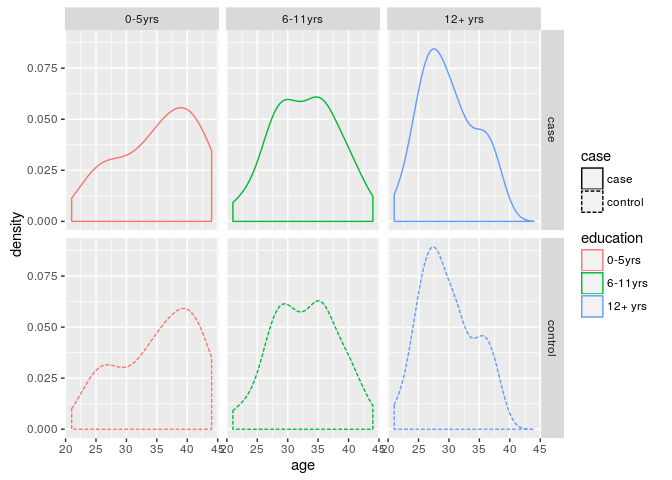

``` r
infert %>% mutate(case = ifelse(case == 0, "control", "case")) %>%
  ggplot(aes(x = age, linetype = case, colour = education)) +
  geom_density() +
  facet_grid(~case + education)
```

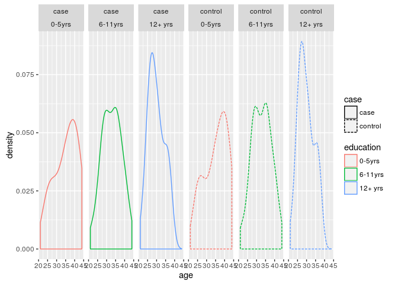

By default each panel has identical x and y axis. Most of the time this is what we want because it facilitates comparisons between the different panels. However, we do have the options of letting either x or y or both scales vary freely between panels.

``` r
# different x axis by column
infert %>% mutate(case = ifelse(case == 0, "control", "case")) %>%
  ggplot(aes(x = age, linetype = case, colour = education)) +
  geom_density() +
  facet_grid(case~education, scales = "free_x")
```

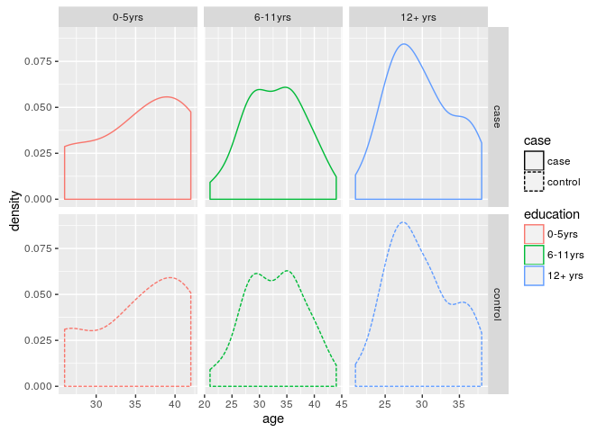

``` r
# different y axis by row
infert %>% mutate(case = ifelse(case == 0, "control", "case")) %>%
  ggplot(aes(x = age, linetype = case, colour = education)) +
  geom_density() +
  facet_grid(case~education, scales = "free_y")
```

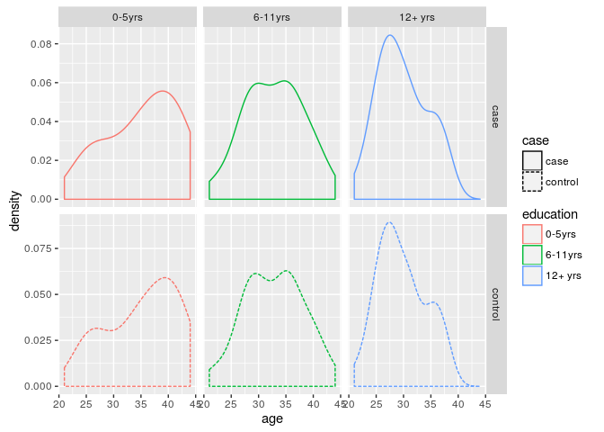

``` r
# different x axis by column; different y axis by row
infert %>% mutate(case = ifelse(case == 0, "control", "case")) %>%
  ggplot(aes(x = age, linetype = case, colour = education)) +
  geom_density() +
  facet_grid(case~education, scales = "free")
```

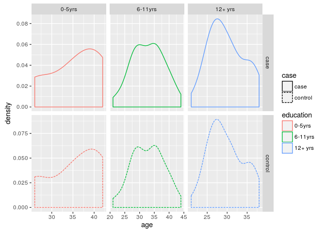

Up until now we have use `facet_grid`. This is perfect for crosstable-like layouts but does not allow us to specify the number of rows/columns or to have varying scales by panel. We use `facet_wrap` if we want to control the number of rows or columns or if we want separate scales for each panel.

``` r
# different x and y axis by panel, 3 columns please
infert %>% mutate(case = ifelse(case == 0, "control", "case")) %>%
  ggplot(aes(x = age, linetype = case, colour = education)) +
  geom_density() +
  facet_wrap(case~education, scales = "free", ncol = 3)
```

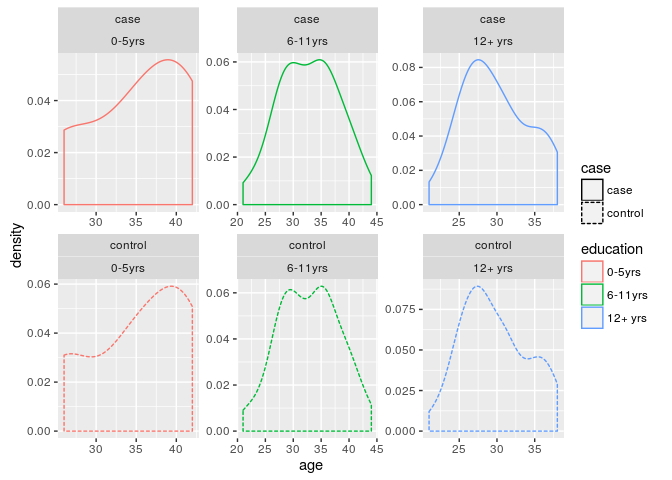

We can use specialized functions that change the way our panels are labelled.

``` r
# panel labels as variable_name:variable_value
infert %>% mutate(case = ifelse(case == 0, "control", "case")) %>%
  ggplot(aes(x = age, linetype = case, colour = education)) +
  geom_density() +
  facet_wrap(case~education, scales = "free", ncol = 3, labeller = label_both)
```

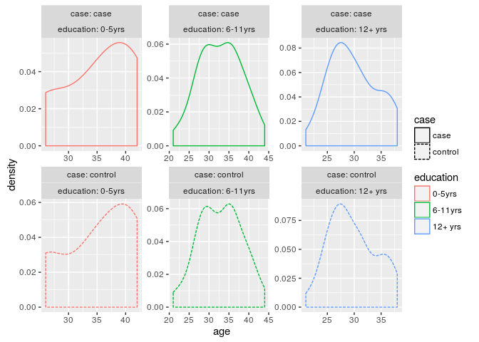

Further Reading
---------------

-   [Tidy Data.](http://www.jstatsoft.org/v59/i10/paper) A lot of confusion about ggplot stems from the data being in an unsuitable format. ggplot works with what its creator calls *tidy data*.
-   [An introduction to data transformation with `dplyr`.](https://cran.rstudio.com/web/packages/dplyr/vignettes/introduction.html) This covers -- among other things -- data pipelines.
-   [An introduction to data tidying with `tidyr`.](https://cran.r-project.org/web/packages/tidyr/vignettes/tidy-data.html). This involves -- among other things -- transforming between long and wide format.
-   [The data wrangling cheat sheet](https://www.rstudio.com/wp-content/uploads/2015/02/data-wrangling-cheatsheet.pdf) is a great quick reference for `dplyr` and `tidyr`.

``` r
sessionInfo()
```

    ## R version 3.2.2 (2015-08-14)
    ## Platform: x86_64-pc-linux-gnu (64-bit)
    ## Running under: Ubuntu 15.10
    ## 
    ## locale:
    ##  [1] LC_CTYPE=en_US.UTF-8       LC_NUMERIC=C              
    ##  [3] LC_TIME=en_GB.UTF-8        LC_COLLATE=en_US.UTF-8    
    ##  [5] LC_MONETARY=en_GB.UTF-8    LC_MESSAGES=en_US.UTF-8   
    ##  [7] LC_PAPER=en_GB.UTF-8       LC_NAME=C                 
    ##  [9] LC_ADDRESS=C               LC_TELEPHONE=C            
    ## [11] LC_MEASUREMENT=en_GB.UTF-8 LC_IDENTIFICATION=C       
    ## 
    ## attached base packages:
    ## [1] stats     graphics  grDevices utils     datasets  methods   base     
    ## 
    ## other attached packages:
    ## [1] ggrepel_0.4   dplyr_0.4.3   tidyr_0.4.1   ggplot2_2.0.0
    ## 
    ## loaded via a namespace (and not attached):
    ##  [1] Rcpp_0.12.3      knitr_1.12.3     magrittr_1.5     munsell_0.4.2   
    ##  [5] colorspace_1.2-6 R6_2.1.2         stringr_1.0.0    plyr_1.8.3      
    ##  [9] tools_3.2.2      parallel_3.2.2   grid_3.2.2       gtable_0.1.2    
    ## [13] DBI_0.3.1        htmltools_0.3    yaml_2.1.13      lazyeval_0.1.10 
    ## [17] digest_0.6.9     assertthat_0.1   reshape2_1.4.1   formatR_1.2.1   
    ## [21] evaluate_0.8     rmarkdown_0.9.5  labeling_0.3     stringi_1.0-1   
    ## [25] scales_0.3.0

cc-by Jonas Schöley 2016
