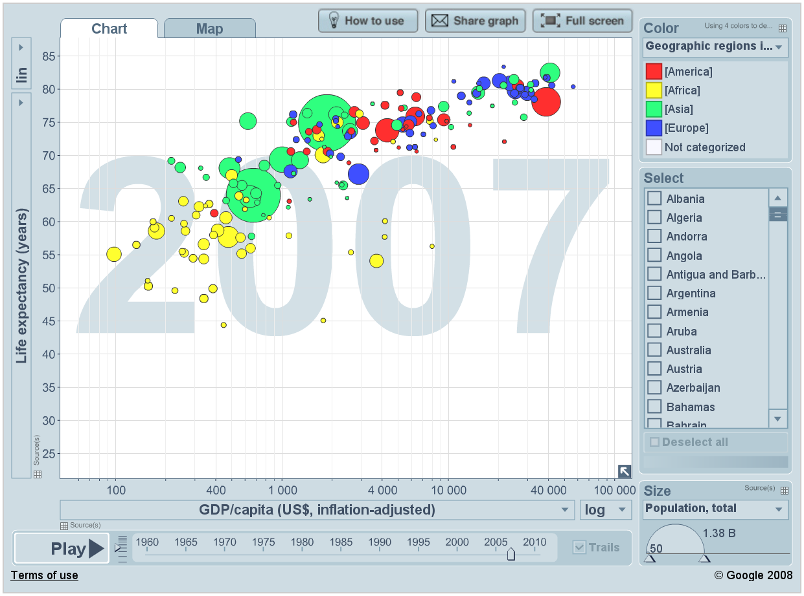

GGplot Workshop: Session 3, Scales I
================
Jonas Schöley
February 16th, 2016

-   [Scales (Versus Aesthetics)](#scales-versus-aesthetics)
-   [Scale Names](#scale-names)
-   [Scale Transformations](#scale-transformations)
-   [Scale Breaks and Labels](#scale-breaks-and-labels)
    -   [Sidenote: Levels and Order in ggplot](#sidenote-levels-and-order-in-ggplot)
-   [Scale Limits](#scale-limits)
    -   [Sidenote: Limiting versus Zooming](#sidenote-limiting-versus-zooming)
-   [And they say every ggplot looks the same](#and-they-say-every-ggplot-looks-the-same)
-   [Further Reading](#further-reading)

``` r
library(ggplot2) # right on!
library(dplyr)   # data transformation
```

    ## 
    ## Attaching package: 'dplyr'

    ## The following objects are masked from 'package:stats':
    ## 
    ##     filter, lag

    ## The following objects are masked from 'package:base':
    ## 
    ##     intersect, setdiff, setequal, union

Scales (Versus Aesthetics)
--------------------------

Interactive plots displayed in a web-browser are all the rage nowadays with [Gapminder World](http://www.gapminder.org/world) being a true classic of the genre.



Today we shall recreate the above chart and in doing so learn about *scales*.

We already know that *aesthetics* are mappings from data dimensions to visual properties. They tell ggplot what goes where. What are the aesthetics in **Gapminder World**?

| Data dimension      | Visual property                       | Scale            |
|:--------------------|:--------------------------------------|:-----------------|
| GDP per capita      | position on x-axis (`x`)              | `scale_x_*`      |
| Life expectancy     | position on y-axis (`y`)              | `scale_y_*`      |
| Population size     | size of plotting symbols (`size`)     | `scale_size_*`   |
| Geographical Region | colour of plotting symbols (`colour`) | `scale_colour_*` |

**Each aesthetic has its own scale**

The four aesthetics in *Gapminder World* are connected to four different scales. The scales are named after the corresponding aesthetic. The naming scheme is `scale_<name of aestetic>_<continuous|discrete|specialized>`.

**Aestetics specify the *what*, scales specify the *how***

Which colour to use for which level in the data? Where to put the labels on the axis? Which labels to put? The size of the largest plotting symbol, the name of the legends, log-transformation of the y-axis, the range of the axis... These are all examples of scale specifications -- specifications on *how* to map a data dimension to a visual attribute.

Off to work!

``` r
library("gapminder") # provides us with the data of the *Gapminder World* chart

head(gapminder)
```

    ## Source: local data frame [6 x 6]
    ## 
    ##       country continent  year lifeExp      pop gdpPercap
    ##        (fctr)    (fctr) (int)   (dbl)    (int)     (dbl)
    ## 1 Afghanistan      Asia  1952  28.801  8425333  779.4453
    ## 2 Afghanistan      Asia  1957  30.332  9240934  820.8530
    ## 3 Afghanistan      Asia  1962  31.997 10267083  853.1007
    ## 4 Afghanistan      Asia  1967  34.020 11537966  836.1971
    ## 5 Afghanistan      Asia  1972  36.088 13079460  739.9811
    ## 6 Afghanistan      Asia  1977  38.438 14880372  786.1134

The data already looks tidy. All we have to do is to subset to a single year. Let's see what ggplot produces if we simply specify the aesthetics to an appropriate geometry.

``` r
gapminder %>% filter(year == 2007) %>%
  ggplot(aes(x = gdpPercap, y = lifeExp, size = pop, colour = continent)) +
  geom_point()
```


A solid foundation. But to close in on the *Gapminder World* chart we need to customize our scales.

**When changing scale attributes we have to make sure to make the changes on the appropriate scale**. Just ask yourself:

1.  What aesthetic does the scale correspond to? `scale_<name of aestetic>_*`
2.  Am I dealing with a *discrete* or *continuous* variable? `scale_*_<continuous|discrete>`

Scale Names
-----------

Once you know which scales to use, names are trivial to change.

``` r
gapminder %>% filter(year == 2007) %>%
  ggplot(aes(x = gdpPercap, y = lifeExp, size = pop, colour = continent)) +
  geom_point() +
  scale_x_continuous(name = "Income per person (GDP/capita, PPP$ inflation-adjusted)") +
  scale_y_continuous(name = "Life expectancy (years)") +
  scale_color_discrete(name = "Continent") +
  scale_size_continuous(name = "Population, total")
```


You can also use mathematical annotation in your scale names. For further information consult `?plotmath`.

``` r
gapminder %>% filter(year == 2007) %>%
  ggplot(aes(x = gdpPercap, y = lifeExp, size = pop, colour = continent)) +
  geom_point() +
  scale_x_continuous(name = expression(over(GDP, capita))) +
  scale_y_continuous(name = expression(e[0])) +
  scale_color_discrete(name = "Continent") +
  scale_size_continuous(name = "Population, total")
```


Scale Transformations
---------------------

Next, we deal with *scale transformations*. In **Gapminder World** the x-axis is log-scaled meaning that the log of the x-axis data is taken before plotting. However, the labels remain on the linear scale. In that regard transforming scales is different from directly transforming the underlying data.

``` r
gapminder %>% filter(year == 2007) %>%
  ggplot(aes(x = gdpPercap, y = lifeExp, size = pop, colour = continent)) +
  geom_point() +
  scale_x_continuous(name = "Income per person (GDP/capita, PPP$ inflation-adjusted)",
                     trans = "log10") +
  scale_y_continuous(name = "Life expectancy (years)") +
  scale_color_discrete(name = "Continent") +
  scale_size_continuous(name = "Population, total")
```


There are many different scale transformations built into ggplot. From the documentation:

> Built-in transformations include "asn", "atanh", "boxcox", "exp", "identity", "log", "log10", "log1p", "log2", "logit", "probability", "probit", "reciprocal", "reverse" and "sqrt".

``` r
gapminder %>% filter(year == 2007) %>%
  ggplot(aes(x = gdpPercap, y = lifeExp, size = pop, colour = continent)) +
  geom_point() +
  scale_x_continuous(name = "Income per person (GDP/capita, PPP$ inflation-adjusted)",
                     trans = "reverse") +
  scale_y_continuous(name = "Life expectancy (years)") +
  scale_color_discrete(name = "Continent") +
  scale_size_continuous(name = "Population, total")
```


Note that the concept of scale transformations is not limited to position scales.

``` r
gapminder %>% filter(year == 2007) %>%
  ggplot(aes(x = gdpPercap, y = lifeExp, size = pop, colour = continent)) +
  geom_point() +
  scale_x_continuous(name = "Income per person (GDP/capita, PPP$ inflation-adjusted)",
                     trans = "log10") +
  scale_y_continuous(name = "Life expectancy (years)") +
  scale_color_discrete(name = "Continent") +
  scale_size_continuous(name = "Population, total", trans = "log10")
```


Scale Breaks and Labels
-----------------------

Next, we manually specify the axis *breaks* and *labels* to be the same as in *Gapminder World*. Axis breaks are the positions where tick-marks and grid-lines are drawn. Labels specify what text to put at the breaks. **Breaks and labels have to be vectors of equal length.**

``` r
gapminder %>% filter(year == 2007) %>%
  ggplot(aes(x = gdpPercap, y = lifeExp, size = pop, colour = continent)) +
  geom_point() +
  scale_x_continuous(name = "Income per person (GDP/capita, PPP$ inflation-adjusted)",
                     trans = "log10",
                     breaks = c(200, 300, 400, 500,
                                600, 700, 800, 900,
                                1000, 2000, 3000, 4000, 5000,
                                6000, 7000, 8000, 9000,
                                10000, 20000, 30000, 40000, 50000,
                                60000, 70000, 80000, 90000),
                     labels = c("200", "", "400", "",
                                "", "", "", "",
                                "1000", "2000", "", "4000", "",
                                "", "", "", "",
                                "10000", "20000", "", "40000", "",
                                "", "", "", "")) +
  scale_y_continuous(name = "Life expectancy (years)",
                     breaks = c(25, 30, 35, 40, 45, 50,
                                55, 60, 65, 70, 75, 80, 85)) +
  scale_color_discrete(name  = "Continent") +
  scale_size_continuous(name = "Population, total")
```


OK, that was effective but clumsy. Luckily ggplot does not care *how* we generate the vector of breaks. We can use any R function as long as it outputs a vector. Even better, instead of manually spelling out the labels for each break we can write a short function that takes the breaks as input and formats them. Much nicer code -- same result.

``` r
gapminder %>% filter(year == 2007) %>%
  ggplot(aes(x = gdpPercap, y = lifeExp, size = pop, colour = continent)) +
  geom_point() +
  scale_x_continuous(name = "Income per person (GDP/capita, PPP$ inflation-adjusted)",
                     trans = "log10",
                     breaks = apply(expand.grid(1:9, 10^(2:4)), 1, FUN = prod)[-1],
                     labels = function(x) {ifelse(grepl("^[124]", x), x, "")}) +
  scale_y_continuous(name = "Life expectancy (years)",
                     breaks = seq(25, 85, 5)) +
  scale_color_discrete(name = "Continent") +
  scale_size_continuous(name = "Population, total")
```


The concept of *breaks* and *labels* does not only apply to continuous axis. **All scales have breaks and labels**. E.g. on a colour scale the breaks are the colour keys, the labels are -- well -- the labels. **We reorder the items on our discrete scale by specifying the breaks in the required order.** We also use an R function to capitalize the labels.

``` r
gapminder %>% filter(year == 2007) %>%
  ggplot(aes(x = gdpPercap, y = lifeExp, size = pop, colour = continent)) +
  geom_point() +
  scale_x_continuous(name = "Income per person (GDP/capita, PPP$ inflation-adjusted)",
                     trans = "log10",
                     breaks = apply(expand.grid(1:9, 10^(2:4)), 1, FUN = prod)[-1],
                     labels = function(x) ifelse(grepl("^[124]", x), x, "")) +
  scale_y_continuous(name = "Life expectancy (years)",
                     breaks = seq(25, 85, 5)) +
  scale_color_discrete(name = "Continent",
                       breaks = c("Asia", "Africa", "Americas", "Europe", "Oceania"),
                       labels = toupper) +
  scale_size_continuous(name = "Population, total")
```


Finally, let's choose some sensible breaks and labels for the size scale.

``` r
gapminder %>% filter(year == 2007) %>%
  ggplot(aes(x = gdpPercap, y = lifeExp, size = pop, colour = continent)) +
  geom_point() +
  scale_x_continuous(name = "Income per person (GDP/capita, PPP$ inflation-adjusted)",
                     trans = "log10",
                     breaks = apply(expand.grid(1:9, 10^(2:4)), 1, FUN = prod)[-1],
                     labels = function(x) ifelse(grepl("^[124]", x), x, "")) +
  scale_y_continuous(name = "Life expectancy (years)",
                     breaks = seq(25, 85, 5)) +
  scale_color_discrete(name = "Continent",
                       breaks = c("Asia", "Africa", "Americas", "Europe", "Oceania"),
                       labels = toupper) +
  scale_size_continuous(name = "Population, total",
                        breaks = c(1E6, 10E6, 100E6, 1E9),
                        labels = function(x) format(x, big.mark = ",", scientific = FALSE))
```


### Sidenote: Levels and Order in ggplot

It is easy to order items on a numerical scale. One just puts them on the number line. Usually low on the left and hight to the right. But what about discrete items? ggplot orders them according to the order of their factor levels. An example:

``` r
# test data
foo <- data.frame(id  = 1:4,
                  sex = c("Female", "Female", "Male", "Male"))
foo
```

    ##   id    sex
    ## 1  1 Female
    ## 2  2 Female
    ## 3  3   Male
    ## 4  4   Male

`data.frame`, just like ggplot, automatically converts a character vector to a factor using `as.factor`. The levels order of that factor follows the sequence of occurence in the data.

``` r
levels(foo$sex)
```

    ## [1] "Female" "Male"

ggplot constructs discrete scales in the order of the levels of the underlying factor variable. Here, Females first, males after.

``` r
ggplot(foo) +
  geom_point(aes(x = sex, y = id, color = sex))
```


If we reverse the level order of the sex variable we change the way ggplot orders the discrete items.

``` r
foo$sex
```

    ## [1] Female Female Male   Male  
    ## Levels: Female Male

``` r
foo$sex <- factor(foo$sex, levels = c("Male", "Female"))
foo$sex
```

    ## [1] Female Female Male   Male  
    ## Levels: Male Female

Now we have males first and females last.

``` r
ggplot(foo) +
  geom_point(aes(x = sex, y = id, color = sex))
```


``` r
ggplot(foo) +
  geom_point(aes(x = sex, y = id, color = sex)) +
  facet_wrap(~sex)
```


**NEVER OVERRIDE THE LEVELS DIRECTLY WHEN JUST MEANING TO CHANGE THE ORDER!** You'll screw up your data. In our case we just changed the sex of the participants.

``` r
foo$sex
```

    ## [1] Female Female Male   Male  
    ## Levels: Male Female

``` r
levels(foo$sex) <- c("Female", "Male")
foo$sex
```

    ## [1] Male   Male   Female Female
    ## Levels: Female Male

Scale Limits
------------

We match the maximum and minimum value of our xy-scales with those of the *Gapminder World* chart by specifying the *limits* of the scales.

``` r
gapminder %>% filter(year == 2007) %>%
  ggplot(aes(x = gdpPercap, y = lifeExp, size = pop, colour = continent)) +
  geom_point() +
  scale_x_continuous(name = "Income per person (GDP/capita, PPP$ inflation-adjusted)",
                     trans = "log10",
                     breaks = apply(expand.grid(1:9, 10^(2:4)), 1, FUN = prod)[-1],
                     labels = function(x) ifelse(grepl("^[124]", x), x, ""),
                     limits = c(200, 90000)) +
  scale_y_continuous(name = "Life expectancy (years)",
                     breaks = seq(25, 85, 5),
                     limits = c(25, 85)) +
  scale_color_discrete(name = "Continent",
                       breaks = c("Asia", "Africa", "Americas", "Europe", "Oceania"),
                       labels = toupper) +
  scale_size_continuous(name = "Population, total",
                        breaks = c(1E6, 10E6, 100E6, 1E9),
                        labels = function(x) format(x, big.mark = ",", scientific = FALSE))
```


### Sidenote: Limiting versus Zooming

Note that values outside of the limits will be discarded. This is of importance if you want to zoom into a plot. Here we "zoom" by changing the limits of the scales...

``` r
gapminder %>% filter(year == 2007) %>%
  ggplot(aes(x = gdpPercap, y = lifeExp)) +
  geom_point(size = 20) +
  scale_x_continuous(limits = c(5000, 20000)) +
  scale_y_continuous(limits = c(70, 80))
```

    ## Warning: Removed 104 rows containing missing values (geom_point).


...and here we zoom by changing the limits of the coordinate system

``` r
gapminder %>% filter(year == 2007) %>%
  ggplot(aes(x = gdpPercap, y = lifeExp)) +
  geom_point(size = 20) +
  coord_cartesian(xlim = c(5000, 20000), ylim = c(70, 80))
```


And they say every ggplot looks the same
----------------------------------------

As always, something to chew on for the hypermotivated...

``` r
gapminder %>% filter(year == 2007) %>%
  ggplot(aes(x = gdpPercap, y = lifeExp, size = pop, fill = continent)) +
  annotate(geom = "text", x = 4000, y = 55, label = 2007,
           colour = "#D3E0E6", size = 50, fontface = "bold") +
  geom_point(colour = "black", shape = 21) +
  scale_x_continuous(name = "Income per person (GDP/capita, PPP$ inflation-adjusted)",
                     trans = "log10",
                     breaks = apply(expand.grid(1:9, 10^(2:4)), 1, FUN = prod)[-1],
                     labels = function(x) ifelse(grepl("^[124]", x), x, ""),
                     limits = c(200, 90000)) +
  scale_y_continuous(name = "Life expectancy (years)",
                     breaks = seq(25, 85, 5),
                     limits = c(25, 85)) +
  scale_fill_manual(name = "Continent",
                    breaks = c("Asia", "Africa", "Americas", "Europe", "Oceania"),
                    labels = toupper,
                    values = c("Asia" = "#2FFF7F",
                               "Africa" = "#FFFF2F",
                               "Americas" = "#FF2F2F",
                               "Europe" = "#3F4FFF",
                               "Oceania" = "white")) +
  scale_size_area(name = "Population, total", max_size = 20,
                  breaks = c(1E6, 10E6, 100E6, 1E9),
                  labels = function(x) format(x, big.mark = ",", scientific = FALSE)) +
  guides(fill = guide_legend(order = 1,
                             override.aes = list(shape = 22, size = 8))) +
  theme_bw() +
  theme(plot.background = element_rect(fill = "#CEDCE3"),
        text = element_text(colour = "#47576B"),
        axis.title = element_text(face = "bold"),
        legend.background = element_rect(fill = "#B5CBD5"),
        legend.key = element_blank())
```


Further Reading
---------------

-   [The ggplot documentation](http://docs.ggplot2.org/current/) contains all the information about different scales and their options along with illustrated examples.
-   [Adding themes to your plot](http://docs.ggplot2.org/dev/vignettes/themes.html)

``` r
sessionInfo()
```

    ## R version 3.2.2 (2015-08-14)
    ## Platform: x86_64-pc-linux-gnu (64-bit)
    ## Running under: Ubuntu 15.10
    ## 
    ## locale:
    ##  [1] LC_CTYPE=en_US.UTF-8       LC_NUMERIC=C              
    ##  [3] LC_TIME=en_GB.UTF-8        LC_COLLATE=en_US.UTF-8    
    ##  [5] LC_MONETARY=en_GB.UTF-8    LC_MESSAGES=en_US.UTF-8   
    ##  [7] LC_PAPER=en_GB.UTF-8       LC_NAME=C                 
    ##  [9] LC_ADDRESS=C               LC_TELEPHONE=C            
    ## [11] LC_MEASUREMENT=en_GB.UTF-8 LC_IDENTIFICATION=C       
    ## 
    ## attached base packages:
    ## [1] stats     graphics  grDevices utils     datasets  methods   base     
    ## 
    ## other attached packages:
    ## [1] gapminder_0.2.0 dplyr_0.4.3     ggplot2_2.0.0  
    ## 
    ## loaded via a namespace (and not attached):
    ##  [1] Rcpp_0.12.3      assertthat_0.1   digest_0.6.9     R6_2.1.2        
    ##  [5] grid_3.2.2       plyr_1.8.3       DBI_0.3.1        gtable_0.1.2    
    ##  [9] magrittr_1.5     evaluate_0.8     scales_0.3.0     stringi_1.0-1   
    ## [13] lazyeval_0.1.10  rmarkdown_0.9.5  labeling_0.3     tools_3.2.2     
    ## [17] stringr_1.0.0    munsell_0.4.2    parallel_3.2.2   yaml_2.1.13     
    ## [21] colorspace_1.2-6 htmltools_0.3    knitr_1.12.3

cc-by Jonas Schöley 2016
