GGplot Workshop: Session 4, Scales II
================
Jonas Schöley
February 23, 2016

-   [Lexis Surfaces in GGplot](#lexis-surfaces-in-ggplot)
    -   [nxm year data](#nxm-year-data)
    -   [Discrete Period and Age Scales](#discrete-period-and-age-scales)
-   [Divergent Colour Scales: Plotting Differences & Proportions](#divergent-colour-scales-plotting-differences-proportions)
-   [Qualitative Colour Scales: Plotting Group Membership](#qualitative-colour-scales-plotting-group-membership)
-   [Further Reading](#further-reading)

``` r
library(ggplot2) # the way its done!

library(dplyr)   # data transformation
```

    ## 
    ## Attaching package: 'dplyr'

    ## The following objects are masked from 'package:stats':
    ## 
    ##     filter, lag

    ## The following objects are masked from 'package:base':
    ## 
    ##     intersect, setdiff, setequal, union

``` r
library(readr)   # read csv directly from the web
```

Lexis Surfaces in GGplot
------------------------

Lexis surfaces show the value of a third variable on a period-age-grid. If the value of the third variable is given via colour the resulting plot is known as "Heatmap" and used in many disciplines. In ggplot we produce heatmaps using `geom_tile()` or `geom_rect()`. These geometries draw rectangles at specified xy-positions. By default all rectangles are equal in size. They can be coloured according to some variable in the data.

`geom_rect()` is faster and produces smaller pdf's, while `geom_tile()` allows to specify the dimensions of the rectangles making it useful for data that does not come in single year period and age intervals.

For now we will ignore the colouring aspect and just look at how ggplot draws rectangles. \#\#\# 1x1 year data We work with data from the [Human Mortality Database](http://www.mortality.org) -- Swedish period mortality rates by sex.

``` r
swe <- read_csv("https://raw.githubusercontent.com/jschoeley/2016-maxo-ggplot/master/4-scales2/mortality_surface_sweden.csv")
swe
```

    ## Source: local data frame [53,918 x 8]
    ## 
    ##    Country Timeframe    Sex  Year   Age      Dx       Nx      mx
    ##      (chr)     (chr)  (chr) (int) (int)   (dbl)    (dbl)   (dbl)
    ## 1      SWE    Period Female  1751     0 5988.00 28214.05 0.21223
    ## 2      SWE    Period   Male  1751     0 6902.00 28626.58 0.24110
    ## 3      SWE    Period Female  1751     1 1286.45 26035.03 0.04941
    ## 4      SWE    Period   Male  1751     1 1359.88 25682.81 0.05295
    ## 5      SWE    Period Female  1751     2  834.56 25880.11 0.03225
    ## 6      SWE    Period   Male  1751     2  882.13 25504.40 0.03459
    ## 7      SWE    Period Female  1751     3  622.00 23917.92 0.02601
    ## 8      SWE    Period   Male  1751     3  655.26 23500.67 0.02788
    ## 9      SWE    Period Female  1751     4  470.99 19876.49 0.02370
    ## 10     SWE    Period   Male  1751     4  497.74 19373.38 0.02569
    ## ..     ...       ...    ...   ...   ...     ...      ...     ...

Only specifying x and y position and omitting colour puts a grey rectangle at every xy position that appears in the data. The resulting plot gives us information about the period-ages where we have mortality data on Swedish females.

``` r
swe %>% filter(Sex == "Female") %>%
  ggplot() +
  geom_tile(aes(x = Year, y = Age))
```

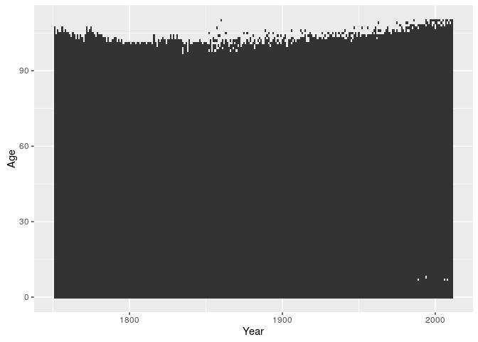

When constructing Lexis surfaces it is a good idea to use isometric scales. The distance corresponding to a single year should be the same on the x and the y scales (a 1x1 rectangle should actually be a square). We can force such an equality by adding a suitable coordinate layer.

``` r
swe %>% filter(Sex == "Female") %>%
  ggplot() +
  geom_tile(aes(x = Year, y = Age)) +
  coord_equal()
```

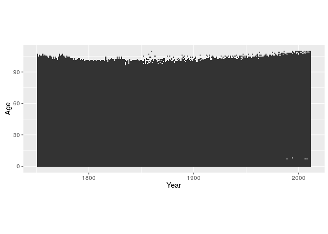

By default the small rectangles have a width and height of 1 scale unit and are drawn over the mid-points of the corresponding x and y values.

``` r
swe %>% filter(Sex == "Female") %>%
  ggplot() +
  geom_tile(aes(x = Year, y = Age), colour = "white") +
  scale_x_continuous(breaks = 1800:1810) +
  scale_y_continuous(breaks = 100:110) +
  coord_equal(xlim = c(1800, 1810), ylim = c(100, 110))
```

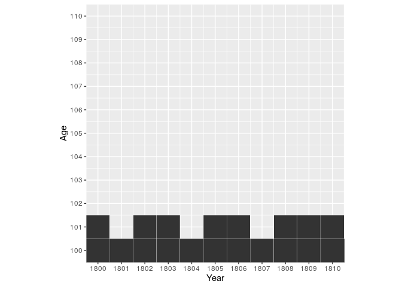

Shifting the data by 0.5 in x and y aligns things neatly.

``` r
swe %>% filter(Sex == "Female") %>%
  mutate(Year = Year + 0.5, Age = Age + 0.5) %>%
  ggplot() +
  geom_tile(aes(x = Year, y = Age), colour = "white") +
  scale_x_continuous(breaks = 1800:1810) +
  scale_y_continuous(breaks = 100:110) +
  coord_equal(xlim = c(1800, 1810), ylim = c(100, 110))
```

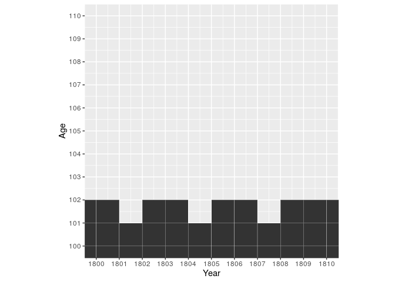

### nxm year data

If our data does not come in single year and age groups we have to adjust the `width` and/or `height` of the rectangles. `width` and `height` are regular aesthetics and can be mapped to variables in the data.

``` r
cod <- read_csv("https://raw.githubusercontent.com/jschoeley/2016-maxo-ggplot/master/4-scales2/cod.csv")
cod
```

    ## Source: local data frame [3,300 x 6]
    ## 
    ##     Year   Age AgeGr     w    Sex        COD
    ##    (int) (int) (chr) (int)  (chr)      (chr)
    ## 1   1925     0    <1     1 Female      Other
    ## 2   1925     0    <1     1   Male      Other
    ## 3   1925     1   1-4     4 Female      Other
    ## 4   1925     1   1-4     4   Male      Other
    ## 5   1925     5   5-9     5 Female      Other
    ## 6   1925     5   5-9     5   Male      Other
    ## 7   1925    10 10-14     5 Female      Other
    ## 8   1925    10 10-14     5   Male      Other
    ## 9   1925    15 15-19     5 Female Infections
    ## 10  1925    15 15-19     5   Male      Other
    ## ..   ...   ...   ...   ...    ...        ...

The Cause of Death data features age groups of different sizes (1, 4, or 5 years). This is how it looks like if we plot it without any regard to the size of the age groups.

``` r
cod %>% filter(Sex == "Female") %>%
  mutate(Year = Year + 0.5) %>%
  ggplot() +
  geom_tile(aes(x = Year, y = Age),
            colour = "white") +
  coord_equal()
```

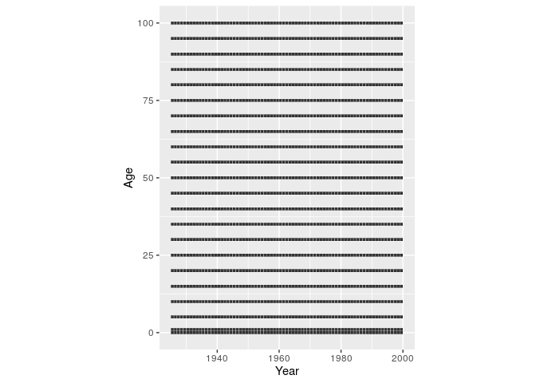

Now we shift the rectangles away from the age midpoint and scale them in height according to the width of the age group.

``` r
cod %>% filter(Sex == "Female") %>%
  mutate(Year = Year + 0.5, Age = Age + w/2) %>%
  ggplot() +
  geom_tile(aes(x = Year, y = Age, height = w),
            colour = "white") +
  coord_equal()
```

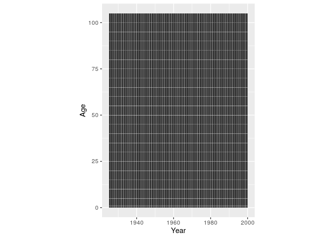

### Discrete Period and Age Scales

If we use discrete axis (happens automatically if we supply a non-numeric variable to the x or y aesthetic) we loose any control over the placement of the age or period groups. They will be equally spaced along the axis.

``` r
cod %>% filter(Sex == "Female") %>%
  mutate(Year = Year + 0.5, Age = AgeGr) %>%
  ggplot() +
  geom_tile(aes(x = Year, y = Age), colour = "white") +
  coord_equal()
```

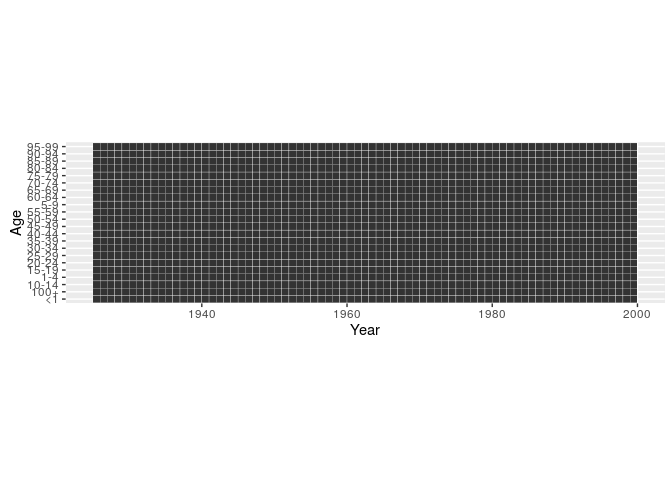

**Avoid character or factor variables as your period or age groups.** Whenever possible go with numeric "Start of Interval" and "Interval Width" variables.

Sequential Colour Scales: Plotting Magnitudes
---------------------------------------------

If we plot magnitudes we would like to use a colour scale which has an intrinsic ordering to it. Scales that vary from dark to light are suitable and we call them "sequential". `scale_fill_brewer(type = "seq")` provides you with such a scale.

``` r
breaks_mx <- c(0, 0.0001, 0.001, 0.01, 0.1, Inf)
swe %>%
  mutate(Year = Year + 0.5, Age = Age + 0.5,
         mx_cut = cut(mx, breaks = breaks_mx)) %>%
  ggplot() +
  geom_tile(aes(x = Year, y = Age, fill = mx_cut)) +
  scale_fill_brewer(type = "seq") +
  facet_wrap(~Sex, ncol = 1) +
  guides(fill = guide_legend(reverse = TRUE)) +
  coord_equal()
```

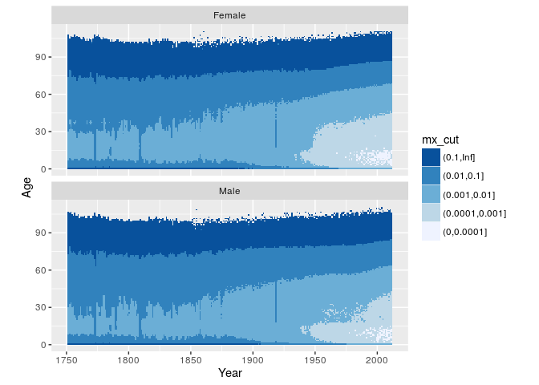

``` r
swe %>%
  mutate(Year = Year + 0.5, Age = Age + 0.5) %>%
  ggplot() +
  geom_tile(aes(x = Year, y = Age, fill = mx)) +
  scale_fill_distiller(type = "seq", palette = "PuBuGn", direction = 1,
                       breaks = breaks_mx,
                       trans = "log10",
                       values = c(0, 0.3, 0.4, 0.5, 0.6, 1),
                       limits = c(0.001, 0.5),
                       oob = scales::squish) +
  facet_wrap(~Sex, ncol = 1) +
  coord_equal()
```

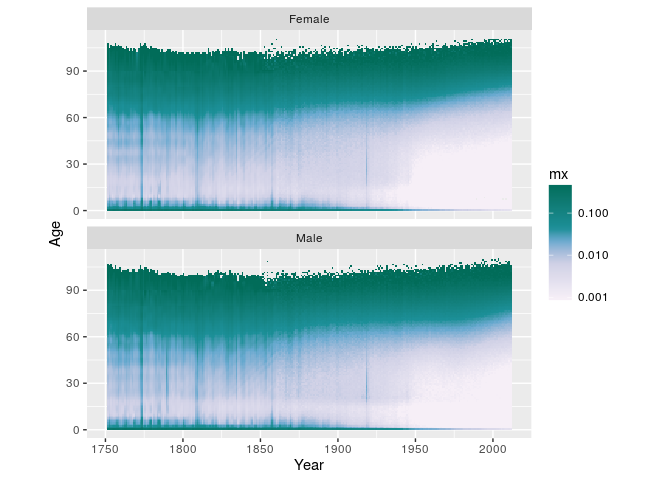

Divergent Colour Scales: Plotting Differences & Proportions
-----------------------------------------------------------

``` r
breaks_prop_mx <- c(0, 0.5, 0.7, 0.9, 1.1, 1.3, 1.5, Inf)
swe %>%
  mutate(Year = Year + 0.5, Age = Age + 0.5) %>%
  select(-Dx, -Nx) %>%
  tidyr::spread(key = Sex, value = mx) %>%
  mutate(fm_prop_mx = Female / Male,
         fm_prop_mx_disc = cut(fm_prop_mx, breaks_prop_mx)) %>%
  ggplot() +
  geom_tile(aes(x = Year, y = Age, fill = fm_prop_mx_disc)) +
  scale_fill_brewer(type = "div", palette = 5, direction = -1) +
  guides(fill = guide_legend(reverse = TRUE)) +
  coord_equal() +
  theme_dark()
```

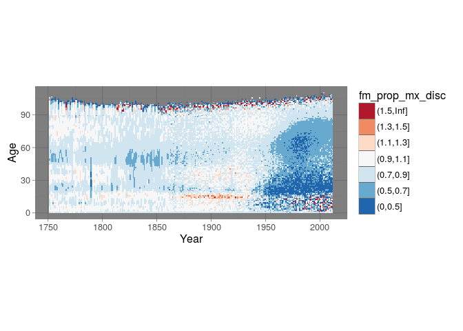

``` r
swe %>%
  mutate(Year = Year + 0.5, Age = Age + 0.5) %>%
  select(-Dx, -Nx) %>%
  tidyr::spread(key = Sex, value = mx) %>%
  mutate(fm_diff_mx = Female / Male) %>%
  ggplot() +
  geom_tile(aes(x = Year, y = Age, fill = fm_diff_mx)) +
  # takes 6 colours from a brewer palette and interpolates
  scale_fill_distiller(type = "div",
                       palette = "RdBu",
                       trans = "log2",
                       limits = c(0.5, 2),
                       oob = scales::squish) +
  coord_equal()
```

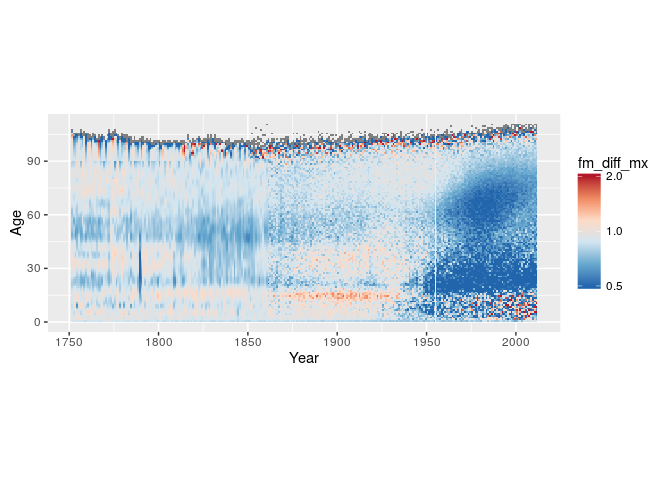

Qualitative Colour Scales: Plotting Group Membership
----------------------------------------------------

``` r
cod %>%
  mutate(Year = Year + 0.5, Age = Age + w/2) %>%
  ggplot() +
  geom_tile(aes(x = Year, y = Age, height = w, fill = COD)) +
  coord_equal() +
  facet_wrap(~Sex, ncol = 2)
```

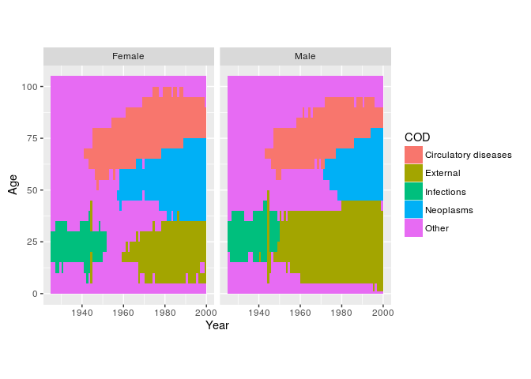

Further Reading
---------------

-   [Explore the colorbrewer palette](http://colorbrewer2.org/)
-   [A handy sheet showing all the brewer palettes](http://mkweb.bcgsc.ca/brewer/swatches/brewer-palettes-swatches.pdf)

``` r
sessionInfo()
```

    ## R version 3.3.1 (2016-06-21)
    ## Platform: x86_64-pc-linux-gnu (64-bit)
    ## Running under: Ubuntu 16.04 LTS
    ## 
    ## locale:
    ##  [1] LC_CTYPE=en_US.UTF-8       LC_NUMERIC=C              
    ##  [3] LC_TIME=en_US.UTF-8        LC_COLLATE=en_US.UTF-8    
    ##  [5] LC_MONETARY=en_US.UTF-8    LC_MESSAGES=en_US.UTF-8   
    ##  [7] LC_PAPER=en_US.UTF-8       LC_NAME=C                 
    ##  [9] LC_ADDRESS=C               LC_TELEPHONE=C            
    ## [11] LC_MEASUREMENT=en_US.UTF-8 LC_IDENTIFICATION=C       
    ## 
    ## attached base packages:
    ## [1] stats     graphics  grDevices utils     datasets  methods   base     
    ## 
    ## other attached packages:
    ## [1] readr_0.2.2   dplyr_0.4.3   ggplot2_2.1.0
    ## 
    ## loaded via a namespace (and not attached):
    ##  [1] Rcpp_0.12.5        knitr_1.13         magrittr_1.5      
    ##  [4] munsell_0.4.3      colorspace_1.2-6   R6_2.1.2          
    ##  [7] stringr_1.0.0      plyr_1.8.4         tools_3.3.1       
    ## [10] parallel_3.3.1     grid_3.3.1         gtable_0.2.0      
    ## [13] DBI_0.4-1          htmltools_0.3.5    yaml_2.1.13       
    ## [16] lazyeval_0.1.10    digest_0.6.9       assertthat_0.1    
    ## [19] tidyr_0.4.1        RColorBrewer_1.1-2 curl_0.9.7        
    ## [22] evaluate_0.9       rmarkdown_0.9.6    labeling_0.3      
    ## [25] stringi_1.1.1      scales_0.4.0

cc-by Jonas Schöley 2016
